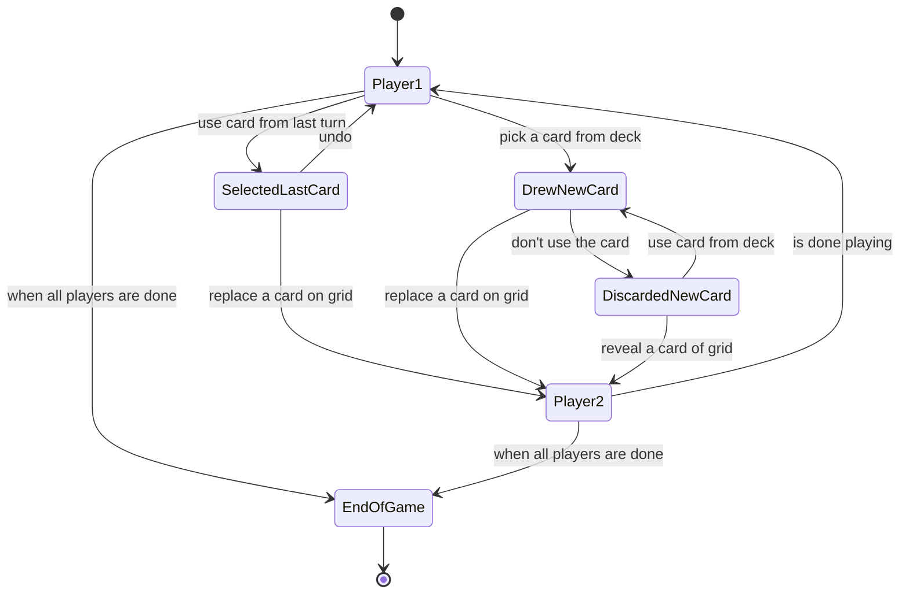

# pico8-hilo

- [règle du jeu de société Hilo](http://jeuxstrategieter.free.fr/Hilo_complet.php)
- Similar game: [Skyjo - Play Skyjo online](https://skyjo.net/)
- [PICO-8 Cheat Sheet (4k).png (3840×2160)](https://www.lexaloffle.com/media/13822/40_PICO-8%20Cheat%20Sheet%20(4k).png)
- [PICO-8 tutorial](https://www.youtube.com/playlist?list=PLavIQQGm3RCmPt93jcg4LEQTvoZRFf9l0) (YouTube playlist by SpaceCat)

## state machine

